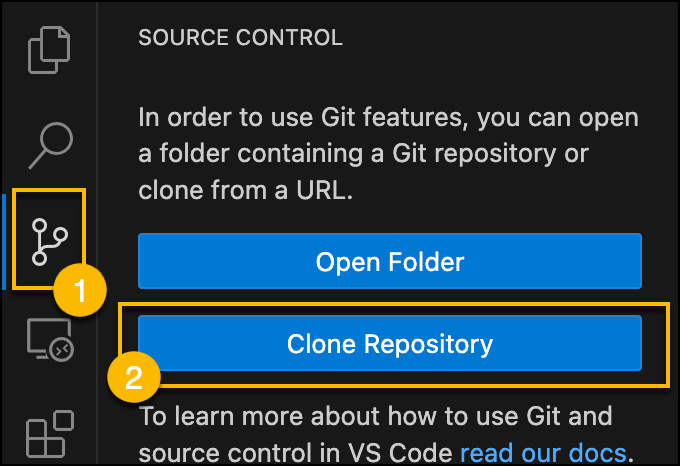
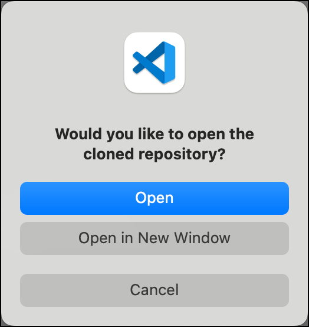

# django-vue-play2learn-template
A template for starting the final Play2Learn project with Django and Vue.

## How to use this template?
1. If you don't have a [GitHub](https://github.com/) account, create a new account. Otherwise, log in. 
2. Go to **Use this template** and select **Create a new repository**. 

3. In the **Create a new repository** menu, name your repository, add a short description, make sure your repo is **Public** if you plan to share your work, and select **Create repository**.

4. You will now need to clone this repository so that you can work with it in Visual Studio Code:

5. Open Visual Studio Code, go to **Source Control** and select **Clone Repository**.

6. Paste in the copied URL and select **Clone from URL**

7. After you select a folder location for your new repo, open the repo in Visual Studio Code.

## How to set up the repo?
1. Create a Python virtual environment and install requirements.txt.
2. Go to vue-games and run `npm install`.

## How to run the project?
1. Run `python manage.py runserver` at the root to start the Django server.
2. Run `npm run serve` at the vue-games folder to start the Vue server.
3. The Vue games will be working at:
    1. Anagram Hunt - [http://127.0.0.1:8000/anagram-hunt/](http://127.0.0.1:8000/anagram-hunt).
    2. Math Facts - [http://127.0.0.1:8000/math-facts/](http://127.0.0.1:8000/math-facts).
  
## Important things to know
We connected Django and Vue so you don't have to worry about that configuration stuff and can get started right
away building out your Django backend, however a quirk of the way we have configured Vue and Django is that the
`vue-games/public/index.html` file is a Django template. In fact, this file generates the `templates/_base_vue.html`.
So, if you want to update the `_base_vue.html` file (e.g., add a header, footer, etc.), you actually need to update that
`index.html` file instead. If you have the Vue dev server running, the `_base_vue.html` file will be updated right away.

For all other Django template, you can create and edit them exactly as you learned in the Django course. No differences there!

## More
If you want to learn more about how we integrated Vue and Django in this template, see [Connecting Django and Vue](https://www.webucator.com/article/connecting-django-and-vue/). This article goes through a similar process to what we did for this template and includes tips for communicating between the Django backend and Vue frontend. Note that is not exactly the same as this template.

## Note from the professor
Hi Mohamed,

In the provided template, we have set up the two Vue games and created a bare-bones connection to a Django backend.

If all you saw was the title for the Anagram Hunt and Math Facts games, make sure you start up the Vue server by opening the vue-games folder at the terminal and running npm install and then npm run serve. You should then see the working games.

In this project, you will build out the rest of the website with the following features:

A working login and registration page.
A My Account page where users can edit their information.
Game tracking and Leaderboard pages that display users' past scores.
A place for users to leave a review.
A place displaying users' reviews.
A Contact Us page that sends an email to the admin email.
An admin site where the admin can view, update, and delete user data.
Building out these pages will be a mix of frontend and backend work. Each page will have most of their HTML content in a Django template file that extends _base_vue.html. While these files will be .html  files, you will find yourself writing a lot of Django code in them. You will handle most of the behavior of these pages in .py files like urls.py, views.py, and models.py. 

Let me know if you have any other questions!

- Justin

